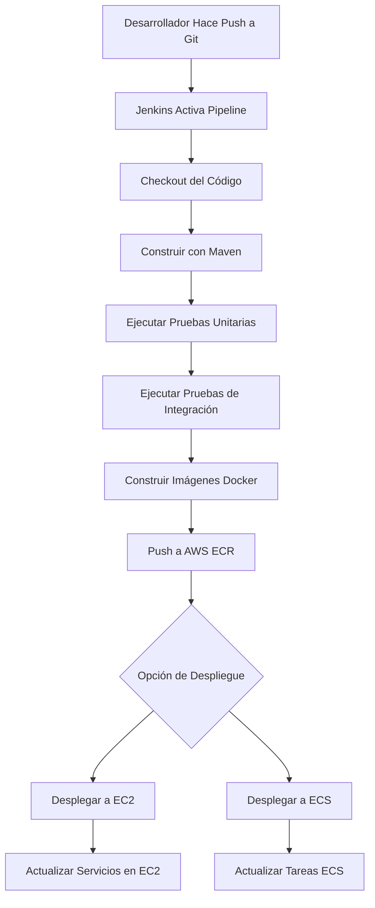
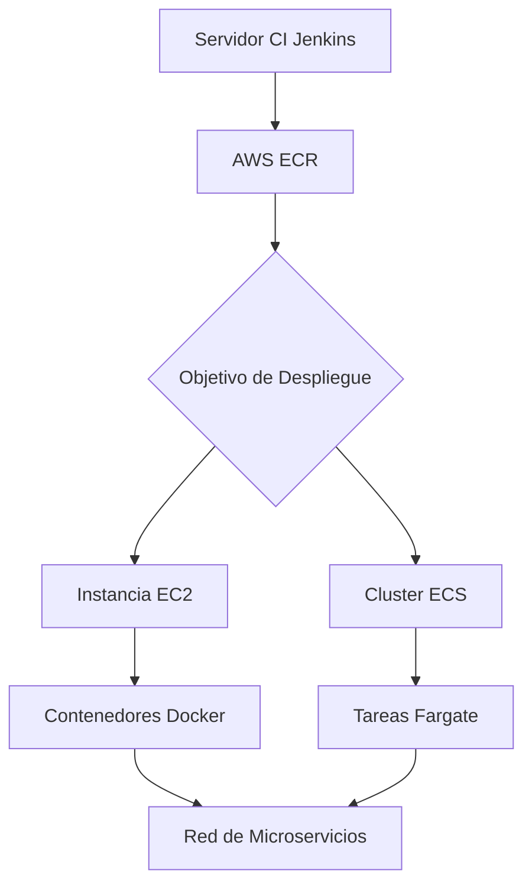

# Guía de CI/CD con Jenkins para Microservicios ARKAM Spring Boot

## Introducción

Esta guía proporciona un proceso claro y paso a paso para implementar Integración Continua (CI) usando Jenkins en el proyecto de microservicios ARKAM. El proyecto consta de microservicios basados en Spring Boot (Config Server, Eureka Server, API Gateway, User Service, Product Service, Order Service y Notification Service) que aún no están completamente dockerizados. Esta guía cubrirá la dockerización, configuración de Jenkins, configuración del pipeline de CI y despliegue en AWS (ya sea en instancias EC2 o usando servicios de AWS como ECS).

El proceso de CI automatizará la construcción, pruebas y despliegue de los microservicios, asegurando calidad del código y entrega rápida.

### Resumen del Proyecto
- **Arquitectura**: Microservicios usando Spring Cloud (Eureka para descubrimiento de servicios, Config Server para configuración centralizada, Gateway para enrutamiento).
- **Tecnologías**: Java 21, Spring Boot 3.5.0, Maven, PostgreSQL, Kafka, RabbitMQ, Docker.
- **Estado Actual**: Los servicios se construyen con Maven pero no están contenerizados. La infraestructura (BD, mensajería) ya está dockerizada vía `docker-compose.yml`.

### Resumen del Flujo de Trabajo CI/CD


## Prerrequisitos

Antes de comenzar, asegúrate de tener:
- **Java 21** instalado.
- **Maven 3.6+** instalado.
- **Docker** y **Docker Compose** instalados.
- **Repositorio Git** para el proyecto (ej. GitHub, GitLab).
- **Cuenta AWS** con permisos necesarios (EC2, ECS, ECR, IAM).
- **Servidor Jenkins**: Ya sea local o en AWS EC2. Instala Jenkins 2.387+ con plugins: Docker Pipeline, AWS Credentials, SSH Agent, etc.

## Paso 1: Dockerizar los Microservicios

Dado que los microservicios aún no están dockerizados, necesitamos crear Dockerfiles para cada servicio y actualizar configuraciones para entornos de contenedores.

### 1.1 Crear Dockerfiles

Para cada microservicio (configserver, eureka, gateway, user, product, order, notification), crea un `Dockerfile` en el directorio raíz del servicio.

Ejemplo de `Dockerfile` para Order Service (adapta para otros, cambiando puertos si es necesario):

```dockerfile
# Multi-stage build for efficiency
FROM maven:3.9.4-openjdk-21-slim AS build
WORKDIR /app
COPY pom.xml .
COPY src ./src
RUN mvn clean package -DskipTests

FROM openjdk:21-jdk-slim
WORKDIR /app
COPY --from=build /app/target/*.jar app.jar
EXPOSE 8080
ENTRYPOINT ["java", "-jar", "/app/app.jar", "--spring.profiles.active=docker"]
```

- **Notas**:
  - Usa construcción multi-etapa para reducir el tamaño de la imagen.
  - Activa perfil `docker` para usar `application-docker.yml`.
  - Puertos: Config Server (8888), Eureka (8761), Gateway (8080), User (8081), Product (8082), Order (8083), Notification (8084).

### 1.2 Actualizar Docker Compose

Agrega los microservicios a `docker-compose.yml` bajo la sección `services`.

Ejemplo para Order Service:

```yaml
order-service:
  build: ./order
  ports:
    - "8083:8083"
  environment:
    - SPRING_PROFILES_ACTIVE=docker
  depends_on:
    - postgres
    - kafka
    - eureka
    - configserver
  networks:
    - backend
```

Repite para cada servicio, ajustando puertos y dependencias.

### 1.3 Probar Dockerización Localmente

1. Construir y ejecutar: `docker-compose up --build`.
2. Verificar que los servicios se registren con Eureka y se comuniquen.

## Paso 2: Configurar Jenkins

### 2.1 Instalar Jenkins

- En EC2: Lanza una instancia EC2 (t2.medium o superior), instala Java, luego Jenkins vía WAR o Docker.
- Instala plugins requeridos: Git, Maven Integration, Docker, Pipeline, AWS Steps, etc.

### 2.2 Configurar Credenciales

En Jenkins > Manage Jenkins > Manage Credentials:
- Agrega credenciales AWS (Access Key ID, Secret Access Key) para acceso a ECR y ECS/EC2.
- Agrega clave SSH para despliegue en EC2 si usas esa opción.
- Agrega credenciales Git si el repo es privado.

### 2.3 Crear un Trabajo de Pipeline en Jenkins

1. Crea un nuevo trabajo de Pipeline.
2. Configura SCM: Apunta a tu repo Git.
3. Usa un `Jenkinsfile` en la raíz del repo para la definición del pipeline.

## Paso 3: Configurar el Pipeline de CI

Crea un `Jenkinsfile` en la raíz del proyecto.

### Ejemplo de Jenkinsfile

```groovy
pipeline {
    agent any
    environment {
        DOCKER_REGISTRY = 'your-aws-account-id.dkr.ecr.us-east-1.amazonaws.com'
        AWS_REGION = 'us-east-1'
    }
    stages {
        stage('Checkout') {
            steps {
                git branch: 'main', url: 'https://github.com/your-repo/arkam-microservices.git'
            }
        }
        stage('Build') {
            steps {
                sh 'mvn clean compile'
            }
        }
        stage('Unit Tests') {
            steps {
                sh 'mvn test'
            }
        }
        stage('Integration Tests') {
            steps {
                // Run integration tests if available
                sh 'mvn verify -Dspring.profiles.active=test'
            }
        }
        stage('Build Docker Images') {
            steps {
                script {
                    def services = ['configserver', 'eureka', 'gateway', 'user', 'product', 'order', 'notification']
                    services.each { service ->
                        docker.build("${DOCKER_REGISTRY}/${service}:latest", "./${service}")
                    }
                }
            }
        }
        stage('Push to ECR') {
            steps {
                script {
                    docker.withRegistry("https://${DOCKER_REGISTRY}", 'aws-ecr-credentials') {
                        def services = ['configserver', 'eureka', 'gateway', 'user', 'product', 'order', 'notification']
                        services.each { service ->
                            docker.image("${DOCKER_REGISTRY}/${service}:latest").push()
                        }
                    }
                }
            }
        }
        stage('Deploy') {
            steps {
                script {
                    // Choose deployment method
                    if (env.DEPLOY_TO == 'EC2') {
                        deployToEC2()
                    } else if (env.DEPLOY_TO == 'ECS') {
                        deployToECS()
                    }
                }
            }
        }
    }
    post {
        always {
            sh 'docker system prune -f'
        }
    }
}

def deployToEC2() {
    // SSH to EC2 and pull/run containers
    sshagent(['ec2-ssh-key']) {
        sh '''
            ssh -o StrictHostKeyChecking=no ec2-user@your-ec2-instance-ip << EOF
                aws ecr get-login-password --region us-east-1 | docker login --username AWS --password-stdin your-aws-account-id.dkr.ecr.us-east-1.amazonaws.com
                docker pull your-aws-account-id.dkr.ecr.us-east-1.amazonaws.com/configserver:latest
                # Repeat for all services
                docker-compose up -d
            EOF
        '''
    }
}

def deployToECS() {
    // Update ECS service
    sh '''
        aws ecs update-service --cluster your-cluster --service your-service --force-new-deployment --region us-east-1
    '''
}
```

- **Notas**:
  - Ajusta la URL del registro, región y credenciales.
  - Para pruebas de integración, asegúrate de que BD/contenedores de prueba estén disponibles.
  - Establece parámetro `DEPLOY_TO` en el trabajo de Jenkins (EC2 o ECS).

## Paso 4: Opciones de Despliegue en AWS

### Opción 1: Desplegar en Instancias EC2

**Pros**: Menor costo, control total sobre la infraestructura, más fácil para equipos pequeños.
**Cons**: Escalado manual, más mantenimiento.

1. Lanza instancias EC2 (una o más para HA).
2. Instala Docker en EC2.
3. Configura grupos de seguridad para puertos.
4. Usa SSH en el pipeline para desplegar (como en el ejemplo de Jenkinsfile).
5. Para escalado, usa Auto Scaling Groups.

### Opción 2: Desplegar en ECS/Fargate

**Pros**: Servicio administrado, auto-escalado, mejor para microservicios.
**Cons**: Mayor costo, curva de aprendizaje.

1. Crea repositorios ECR para cada servicio.
2. Configura cluster ECS, definiciones de tareas y servicios.
3. Usa AWS CLI en el pipeline para actualizar servicios (como en Jenkinsfile).
4. Para Fargate, no hay gestión de EC2.

### Diagrama de Arquitectura de Despliegue



## Paso 5: Pruebas y Monitoreo

- **Pruebas**: Asegúrate de que las pruebas unitarias e de integración pasen. Agrega SonarQube para calidad del código.
- **Monitoreo**: Usa Prometheus/Grafana (ya en docker-compose) para métricas.
- **Rollback**: Mantén imágenes anteriores para rollback rápido.

## Conclusión

Esta guía habilita CI/CD para tus microservicios ARKAM, mejorando la velocidad de desarrollo y la confiabilidad. Comienza con la dockerización, luego configura Jenkins, y elige la opción de despliegue en AWS que se ajuste a tus necesidades. Monitorea los pipelines e itera según sea necesario.

Para problemas, revisa logs de Jenkins, construcciones Docker y consola AWS.