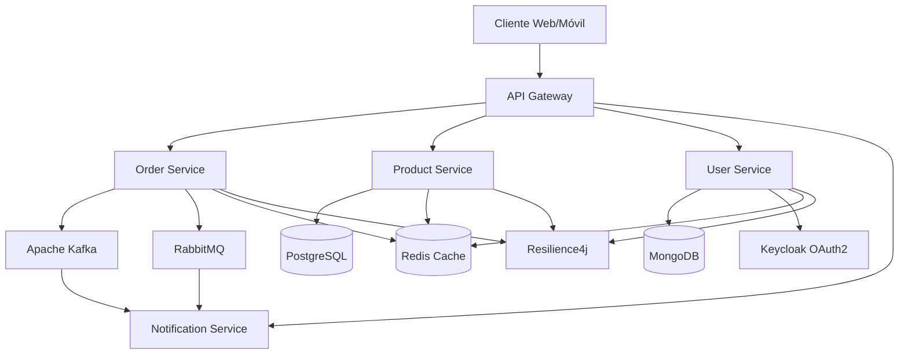
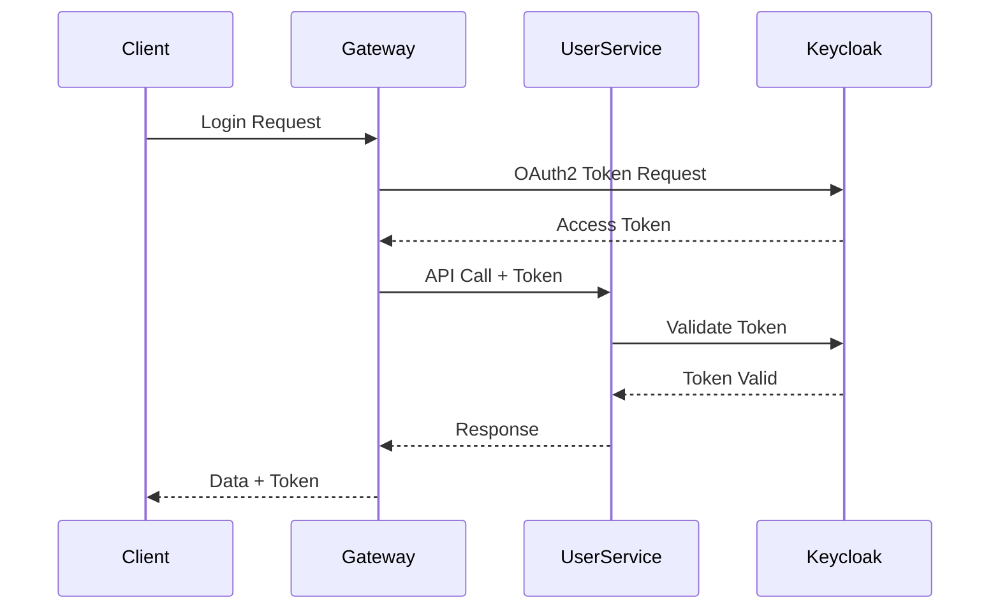

# ARKAM Microservices - Tecnologías y Herramientas

## 📋 Resumen de Tecnologías

Este documento detalla todas las tecnologías, frameworks y herramientas utilizadas en la arquitectura de microservicios ARKAM, explicando su propósito, configuración y beneficios.

---

## 🏗️ Arquitectura General



---

## ☕ **Spring Boot 3.5.0**

### **¿Qué es?**
Framework principal para el desarrollo de microservicios basado en Spring.

### **¿Por qué se eligió?**
- **Ecosistema Completo**: Integración nativa con todas las tecnologías del stack
- **Auto-configuración**: Configuración automática de dependencias
- **Actuadores**: Monitoreo y métricas integradas
- **Testing**: Soporte robusto para pruebas unitarias e integración

### **Configuración en el Proyecto**
```xml
<parent>
    <groupId>org.springframework.boot</groupId>
    <artifactId>spring-boot-starter-parent</artifactId>
    <version>3.5.0</version>
</parent>
```

### **Dependencias Principales**
```xml
<!-- Web Services -->
<dependency>
    <groupId>org.springframework.boot</groupId>
    <artifactId>spring-boot-starter-web</artifactId>
</dependency>

<!-- Reactive Programming -->
<dependency>
    <groupId>org.springframework.boot</groupId>
    <artifactId>spring-boot-starter-webflux</artifactId>
</dependency>

<!-- Data Access -->
<dependency>
    <groupId>org.springframework.boot</groupId>
    <artifactId>spring-boot-starter-data-jpa</artifactId>
</dependency>

<!-- Monitoring -->
<dependency>
    <groupId>org.springframework.boot</groupId>
    <artifactId>spring-boot-starter-actuator</artifactId>
</dependency>
```

---

## 🌐 **Spring Cloud 2025.0.0**

### **¿Qué es?**
Conjunto de herramientas para construir microservicios distribuidos.

### **Componentes Utilizados**

#### **Service Discovery - Eureka**
```xml
<dependency>
    <groupId>org.springframework.cloud</groupId>
    <artifactId>spring-cloud-starter-netflix-eureka-client</artifactId>
</dependency>
```

**Configuración:**
```yaml
eureka:
  client:
    service-url:
      defaultZone: http://localhost:8761/eureka/
  instance:
    prefer-ip-address: true
```

**Beneficios:**
- **Auto-descubrimiento**: Los servicios se registran automáticamente
- **Load Balancing**: Distribución automática de carga
- **Health Checks**: Monitoreo de estado de servicios

#### **Configuration Server**
```xml
<dependency>
    <groupId>org.springframework.cloud</groupId>
    <artifactId>spring-cloud-starter-config</artifactId>
</dependency>
```

**Beneficios:**
- **Configuración Centralizada**: Un solo lugar para todas las configuraciones
- **Actualización Dinámica**: Cambios sin reiniciar servicios
- **Perfiles por Ambiente**: Dev, Test, Prod

---

## 🚀 **Apache Kafka**

### **¿Qué es?**
Sistema de mensajería distribuida de alto rendimiento para streaming de datos.

### **¿Por qué se eligió?**
- **Alto Rendimiento**: Millones de mensajes por segundo
- **Durabilidad**: Persistencia de mensajes
- **Escalabilidad**: Distribución horizontal
- **Orden de Mensajes**: Garantía de orden por partición

### **Configuración en el Proyecto**
```xml
<dependency>
    <groupId>org.springframework.cloud</groupId>
    <artifactId>spring-cloud-stream-binder-kafka</artifactId>
</dependency>
```

### **Uso en Order Service**
```java
// Publisher de eventos
@Service
public class OrderService {
    private final StreamBridge streamBridge;
    
    public Mono<OrderResponse> createOrder(String userId) {
        // ... lógica de negocio ...
        
        // Publicar evento
        OrderCreatedEvent event = new OrderCreatedEvent(
            savedOrder.getId(),
            savedOrder.getUserId(),
            savedOrder.getStatus(),
            orderItems,
            savedOrder.getTotalAmount(),
            savedOrder.getCreatedAt()
        );
        streamBridge.send("createOrder-out-0", event);
        
        return Mono.just(mapToOrderResponse(savedOrder));
    }
}
```

### **Configuración Kafka**
```yaml
spring:
  cloud:
    stream:
      kafka:
        binder:
          brokers: localhost:9092
        bindings:
          createOrder-out-0:
            destination: order-created-events
            producer:
              partition-count: 3
```

### **Beneficios en ARKAM**
- **Event Sourcing**: Trazabilidad completa de eventos
- **Desacoplamiento**: Servicios independientes
- **Resilencia**: Tolerancia a fallos
- **Escalabilidad**: Procesamiento paralelo

---

## 🐰 **RabbitMQ**

### **¿Qué es?**
Broker de mensajes que implementa el protocolo AMQP (Advanced Message Queuing Protocol).

### **¿Por qué se eligió?**
- **Simplicidad**: Fácil configuración y uso
- **Confiabilidad**: Garantías de entrega
- **Flexibilidad**: Múltiples patrones de mensajería
- **Web UI**: Interfaz gráfica para monitoreo

### **Configuración en el Proyecto**
```xml
<dependency>
    <groupId>org.springframework.cloud</groupId>
    <artifactId>spring-cloud-starter-bus-amqp</artifactId>
</dependency>
```

### **Uso en Product Service**
```java
@Configuration
public class RabbitMQConfiguration {
    
    @Bean
    public TopicExchange productExchange() {
        return new TopicExchange("product.exchange");
    }
    
    @Bean
    public Queue productUpdateQueue() {
        return QueueBuilder.durable("product.update.queue").build();
    }
    
    @Bean
    public Binding productUpdateBinding() {
        return BindingBuilder
            .bind(productUpdateQueue())
            .to(productExchange())
            .with("product.update.#");
    }
}
```

### **Publisher de Eventos**
```java
@Service
public class ProductService {
    private final RabbitTemplate rabbitTemplate;
    
    public void updateProduct(Long id, UpdateProductRequestDto requestDto) {
        // ... lógica de actualización ...
        
        // Publicar evento de actualización
        ProductUpdatedEvent event = new ProductUpdatedEvent(
            product.getId(),
            product.getName(),
            product.getPrice(),
            LocalDateTime.now()
        );
        
        rabbitTemplate.convertAndSend(
            "product.exchange", 
            "product.update", 
            event
        );
    }
}
```

### **Consumer de Eventos**
```java
@Component
public class ProductEventListener {
    
    @RabbitListener(queues = "product.update.queue")
    public void handleProductUpdate(ProductUpdatedEvent event) {
        log.info("Producto actualizado: {}", event.getProductId());
        // Lógica de procesamiento
    }
}
```

---

## 🔐 **Keycloak**

### **¿Qué es?**
Solución de gestión de identidad y acceso (IAM) de código abierto.

### **¿Por qué se eligió?**
- **Estándares Abiertos**: OAuth2, OpenID Connect, SAML
- **Multi-tenancy**: Soporte para múltiples organizaciones
- **UI Administrativa**: Gestión visual de usuarios y roles
- **Integración Spring**: Fácil integración con Spring Security

### **Configuración en User Service**
```xml
<dependency>
    <groupId>org.keycloak</groupId>
    <artifactId>keycloak-admin-client</artifactId>
</dependency>
```

### **Integración con User Service**
```java
@Service
public class UserService {
    private final KeycloakPort keycloakPort;
    
    public UserResponseDto createUser(CreateUserRequestDto requestDto) {
        // 1. Obtener token de administrador
        String token = keycloakPort.getAdminAccessToken();
        
        // 2. Crear usuario en Keycloak
        String keycloakUserId = keycloakPort.createUser(token, requestDto);
        
        // 3. Asignar rol por defecto
        keycloakPort.assignRealmRoleToUser(
            requestDto.getUsername(), 
            "USER", 
            keycloakUserId
        );
        
        // 4. Guardar en base de datos local
        User user = userMapper.toUser(requestDto);
        user.setKeycloakId(keycloakUserId);
        User savedUser = userRepository.save(user);
        
        return userMapper.toResponseDto(savedUser);
    }
}
```

### **Configuración Keycloak**
```yaml
keycloak:
  server-url: ${KEYCLOAK_SERVER_URL:http://localhost:8080}
  realm: ${KEYCLOAK_REALM:arkam}
  client-id: ${KEYCLOAK_CLIENT_ID:arkam-client}
  client-secret: ${KEYCLOAK_CLIENT_SECRET:secret}
  admin:
    username: ${KEYCLOAK_ADMIN_USER:admin}
    password: ${KEYCLOAK_ADMIN_PASSWORD:admin}
```

### **Flujo de Autenticación OAuth2**


---

## 🔑 **OAuth2 / OpenID Connect**

### **¿Qué es?**
Estándar de autorización que permite a aplicaciones obtener acceso limitado a cuentas de usuario.

### **Flujos Implementados**

#### **Authorization Code Flow**
```java
@Configuration
@EnableWebSecurity
public class SecurityConfig {
    
    @Bean
    public SecurityFilterChain filterChain(HttpSecurity http) throws Exception {
        http
            .oauth2Login(oauth2 -> oauth2
                .loginPage("/oauth2/authorization/keycloak")
                .defaultSuccessUrl("/dashboard", true)
            )
            .oauth2ResourceServer(oauth2 -> oauth2
                .jwt(jwt -> jwt
                    .jwtAuthenticationConverter(jwtAuthenticationConverter())
                )
            );
        return http.build();
    }
}
```

#### **JWT Token Validation**
```java
@Component
public class JwtAuthenticationConverter implements Converter<Jwt, AbstractAuthenticationToken> {
    
    @Override
    public AbstractAuthenticationToken convert(Jwt jwt) {
        Collection<GrantedAuthority> authorities = extractAuthorities(jwt);
        return new JwtAuthenticationToken(jwt, authorities);
    }
    
    private Collection<GrantedAuthority> extractAuthorities(Jwt jwt) {
        return jwt.getClaimAsStringList("realm_access.roles")
            .stream()
            .map(role -> new SimpleGrantedAuthority("ROLE_" + role))
            .collect(Collectors.toList());
    }
}
```

### **Configuración OAuth2**
```yaml
spring:
  security:
    oauth2:
      client:
        registration:
          keycloak:
            client-id: arkam-client
            client-secret: secret
            scope: openid,profile,email
            authorization-grant-type: authorization_code
            redirect-uri: "{baseUrl}/login/oauth2/code/{registrationId}"
        provider:
          keycloak:
            issuer-uri: http://localhost:8080/realms/arkam
```

---

## 🗄️ **Redis**

### **¿Qué es?**
Base de datos en memoria de estructura de datos que se puede usar como base de datos, caché y agente de mensajes.

### **¿Por qué se eligió?**
- **Rendimiento**: Acceso ultra-rápido en memoria
- **Estructuras de Datos**: Strings, Hashes, Lists, Sets, Sorted Sets
- **Persistencia**: Opciones de persistencia en disco
- **Clustering**: Soporte para alta disponibilidad

### **Configuración en el Proyecto**
```xml
<dependency>
    <groupId>org.springframework.boot</groupId>
    <artifactId>spring-boot-starter-data-redis</artifactId>
</dependency>
```

### **Uso como Caché**
```java
@Service
public class ProductService {
    
    @Cacheable(value = "products", key = "#id")
    public ProductResponseDto findProductById(Long id) {
        return productRepository.findById(id)
            .map(productMapper::toResponseDto)
            .orElseThrow(() -> new ProductNotFoundException("Producto no encontrado"));
    }
    
    @CacheEvict(value = "products", key = "#id")
    public ProductResponseDto updateProduct(Long id, UpdateProductRequestDto requestDto) {
        // Lógica de actualización
        return updatedProduct;
    }
}
```

### **Configuración Redis**
```yaml
spring:
  redis:
    host: ${REDIS_HOST:localhost}
    port: ${REDIS_PORT:6379}
    password: ${REDIS_PASSWORD:}
    timeout: 2000ms
    lettuce:
      pool:
        max-active: 8
        max-idle: 8
        min-idle: 0
```

### **Uso para Sesiones**
```java
@Configuration
@EnableRedisHttpSession
public class RedisSessionConfig {
    
    @Bean
    public LettuceConnectionFactory connectionFactory() {
        return new LettuceConnectionFactory(
            new RedisStandaloneConfiguration("localhost", 6379)
        );
    }
}
```

---

## ⚡ **Resilience4j**

### **¿Qué es?**
Biblioteca de resiliencia para Java 8+ inspirada en Netflix Hystrix.

### **¿Por qué se eligió?**
- **Circuit Breaker**: Protección contra fallos en cascada
- **Retry**: Reintentos automáticos con backoff
- **Rate Limiting**: Control de velocidad de solicitudes
- **Bulkhead**: Aislamiento de recursos

### **Configuración en el Proyecto**
```xml
<dependency>
    <groupId>org.springframework.cloud</groupId>
    <artifactId>spring-cloud-starter-circuitbreaker-resilience4j</artifactId>
</dependency>
```

### **Circuit Breaker en Order Service**
```java
@Service
public class CartService {
    
    @CircuitBreaker(name = "productService", fallbackMethod = "addToCartFallBack")
    @Retry(name = "retryBreaker", fallbackMethod = "addToCartFallBack")
    public boolean addToCart(String userId, CartItemRequest request) {
        // Llamada a servicio externo
        ProductResponse productResponse = productServiceClient.getProductDetails(request.getProductId());
        
        if (productResponse == null || productResponse.getStockQuantity() < request.getQuantity()) {
            return false;
        }
        
        // Lógica de negocio
        return true;
    }
    
    public boolean addToCartFallBack(String userId, CartItemRequest request, Exception exception) {
        log.error("Fallback ejecutado para addToCart: {}", exception.getMessage());
        return false;
    }
}
```

### **Configuración Resilience4j**
```yaml
resilience4j:
  circuitbreaker:
    instances:
      productService:
        failure-rate-threshold: 50
        wait-duration-in-open-state: 30s
        sliding-window-size: 10
        minimum-number-of-calls: 5
  retry:
    instances:
      retryBreaker:
        max-attempts: 3
        wait-duration: 1s
        exponential-backoff-multiplier: 2
```

### **Métricas y Monitoreo**
```java
@Component
public class CircuitBreakerMetrics {
    
    private final MeterRegistry meterRegistry;
    private final CircuitBreakerRegistry circuitBreakerRegistry;
    
    @EventListener
    public void onCircuitBreakerStateChange(CircuitBreakerOnStateTransitionEvent event) {
        log.info("Circuit Breaker {} cambió de {} a {}", 
            event.getCircuitBreakerName(), 
            event.getStateTransition().getFromState(), 
            event.getStateTransition().getToState());
    }
}
```

---

## 🗃️ **Bases de Datos**

### **PostgreSQL (Product Service)**
```yaml
spring:
  datasource:
    url: jdbc:postgresql://localhost:5432/arkam_products
    username: ${DB_USERNAME:arkam_user}
    password: ${DB_PASSWORD:arkam_password}
    driver-class-name: org.postgresql.Driver
  jpa:
    hibernate:
      ddl-auto: update
    show-sql: false
    properties:
      hibernate:
        dialect: org.hibernate.dialect.PostgreSQLDialect
```

### **MongoDB (User Service)**
```yaml
spring:
  data:
    mongodb:
      uri: mongodb://localhost:27017/arkam_users
      database: arkam_users
```

---

## 📊 **Monitoreo y Observabilidad**

### **Spring Boot Actuator**
```xml
<dependency>
    <groupId>org.springframework.boot</groupId>
    <artifactId>spring-boot-starter-actuator</artifactId>
</dependency>
```

### **Endpoints de Monitoreo**
```yaml
management:
  endpoints:
    web:
      exposure:
        include: health,info,metrics,prometheus
  endpoint:
    health:
      show-details: always
  metrics:
    export:
      prometheus:
        enabled: true
```

### **Health Checks Personalizados**
```java
@Component
public class KeycloakHealthIndicator implements HealthIndicator {
    
    @Override
    public Health health() {
        try {
            // Verificar conexión con Keycloak
            keycloakPort.getAdminAccessToken();
            return Health.up()
                .withDetail("keycloak", "Available")
                .build();
        } catch (Exception e) {
            return Health.down()
                .withDetail("keycloak", "Unavailable")
                .withException(e)
                .build();
        }
    }
}
```

---

## 🐳 **Docker y Contenedores**

### **Docker Compose para Desarrollo**
```yaml
version: '3.8'
services:
  postgres:
    image: postgres:15
    environment:
      POSTGRES_DB: arkam
      POSTGRES_USER: arkam_user
      POSTGRES_PASSWORD: arkam_password
    ports:
      - "5432:5432"
    volumes:
      - postgres_data:/var/lib/postgresql/data

  mongodb:
    image: mongo:6.0
    ports:
      - "27017:27017"
    volumes:
      - mongodb_data:/data/db

  redis:
    image: redis:7-alpine
    ports:
      - "6379:6379"
    command: redis-server --appendonly yes
    volumes:
      - redis_data:/data

  kafka:
    image: confluentinc/cp-kafka:latest
    environment:
      KAFKA_ZOOKEEPER_CONNECT: zookeeper:2181
      KAFKA_ADVERTISED_LISTENERS: PLAINTEXT://localhost:9092
      KAFKA_OFFSETS_TOPIC_REPLICATION_FACTOR: 1
    ports:
      - "9092:9092"

  rabbitmq:
    image: rabbitmq:3-management
    environment:
      RABBITMQ_DEFAULT_USER: arkam
      RABBITMQ_DEFAULT_PASS: arkam_password
    ports:
      - "5672:5672"
      - "15672:15672"

  keycloak:
    image: quay.io/keycloak/keycloak:latest
    environment:
      KEYCLOAK_ADMIN: admin
      KEYCLOAK_ADMIN_PASSWORD: admin
    ports:
      - "8080:8080"
    command: start-dev

volumes:
  postgres_data:
  mongodb_data:
  redis_data:
```

---

## 📈 **Métricas y Rendimiento**

### **Tecnologías de Monitoreo**
- **Micrometer**: Métricas de aplicación
- **Prometheus**: Recolección de métricas
- **Grafana**: Visualización de métricas
- **Jaeger**: Trazabilidad distribuida

### **Métricas Personalizadas**
```java
@Component
public class CustomMetrics {
    
    private final Counter orderCreatedCounter;
    private final Timer orderProcessingTimer;
    
    public CustomMetrics(MeterRegistry meterRegistry) {
        this.orderCreatedCounter = Counter.builder("orders.created")
            .description("Número de órdenes creadas")
            .register(meterRegistry);
            
        this.orderProcessingTimer = Timer.builder("orders.processing.time")
            .description("Tiempo de procesamiento de órdenes")
            .register(meterRegistry);
    }
    
    public void incrementOrderCreated() {
        orderCreatedCounter.increment();
    }
    
    public void recordOrderProcessingTime(Duration duration) {
        orderProcessingTimer.record(duration);
    }
}
```

---

## 🚀 **Resumen de Beneficios por Tecnología**

| Tecnología | Propósito | Beneficio Principal |
|------------|-----------|-------------------|
| **Spring Boot** | Framework Base | Desarrollo rápido y productivo |
| **Spring Cloud** | Microservicios | Service discovery y configuración |
| **Apache Kafka** | Event Streaming | Procesamiento de eventos en tiempo real |
| **RabbitMQ** | Message Broker | Comunicación asíncrona confiable |
| **Keycloak** | Identity Management | Autenticación y autorización centralizada |
| **OAuth2** | Authorization | Estándar de seguridad |
| **Redis** | Cache/Session Store | Rendimiento ultra-rápido |
| **Resilience4j** | Resilience Patterns | Tolerancia a fallos |
| **PostgreSQL** | Relational DB | Consistencia ACID |
| **MongoDB** | Document DB | Flexibilidad de esquema |

---

**Versión**: 2.0.0  
**Fecha**: $(date)  
**Autor**: Equipo de Desarrollo ARKAM  
**Tipo**: Documentación Técnica de Tecnologías
